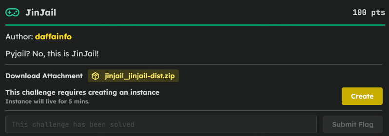
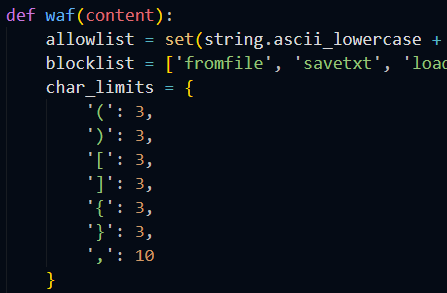
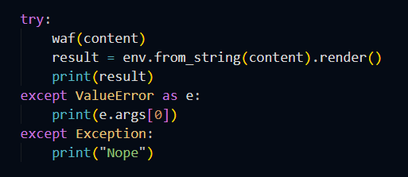
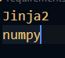
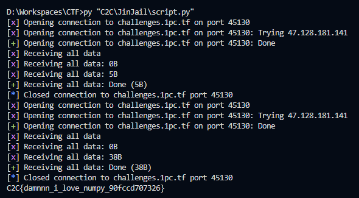

# C2C CTF Task : JinJail

### Introduction



> The challenge is a Jinja2 Sandbox escape, but `app.py` enforces a strict WAF. It blocks quotes, limits brackets/parentheses to 3 each, and restricts common words. The only external module injected into the Jinja environment is `numpy`, meaning any escape has to be routed through Numpy's module tree to find `os` or `sys`.



### Bypassing the Quote Filter:


> Since I couldn't use single or double quotes to pass strings (like the command I wanted to run), I used the `dict(os=1)` trick in a for-loop to generate the string `'os'`. To pass the actual execution command without triggering the WAF's character limits, I mapped the execution to `stdin.readline()`. This forced the template to pause and read my next input line, completely bypassing the Jinja WAF for the actual payload.

### The "Nope" Trap: 



> While testing payloads, I kept getting "Nope" and assumed my WAF bypass was failing. Looking closer at the `try/except` block in `app.py`, I noticed a flaw: both WAF violations (`ValueError`) and standard Jinja crashes (`Exception`) print the exact same "Nope" string. I wasn't failing the WAF; my template was just crashing and hiding the error.

### The Numpy 2.0 Obstacle:



> I initially tried using `numpy.sys.modules` to reach `os.system`, but it kept crashing the template (giving me the generic "Nope"). I realized the server installs dependencies via `requirements.txt` without version pinning, meaning it pulled Numpy 2.0+. Because Numpy 2.0 removed the direct `sys` alias, I had to hunt for deeper submodules. I iterated through paths like `numpy.typing.sys` and `numpy.f2py.sys` until one successfully resolved.

### Script :
> Once I finally got code execution, I couldn't just `cat /root/flag.txt` directly because the file is restricted to root (`chmod 400`). However, looking at the Dockerfile, a custom C program (`fix.c`) is compiled into a SUID binary at `/fix`. By passing `/fix help` into my `stdin.readline()` prompt, the binary executed as root and printed the flag for me

```py
from pwn import *

HOST = "challenges.1pc.tf"
PORT = 26653

paths = [
    "numpy.typing.sys",
    "numpy.f2py.sys",
    "numpy.testing.sys",
    "numpy.char.sys"
]

for p in paths:
    r = remote(HOST, PORT)
    r.recvuntil(b">>> ")

    payload = ""
    r.send(payload.encode() + b"\n")
    r.send(b"/fix help\n")

    out = r.recvall(timeout=3).decode(errors="ignore").strip()
    r.close()

    if out and out != "Nope":
        print(out)
        break
```

After Executed the file, you will recieve the flag at the end. Don't forget to replace the port with the activ one :D

