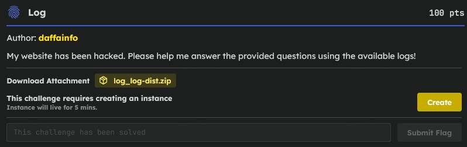
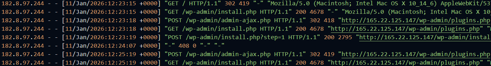
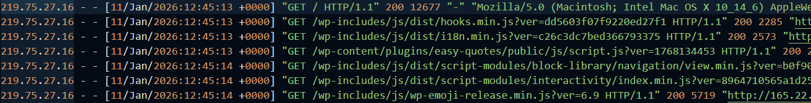
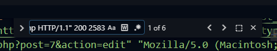
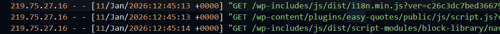
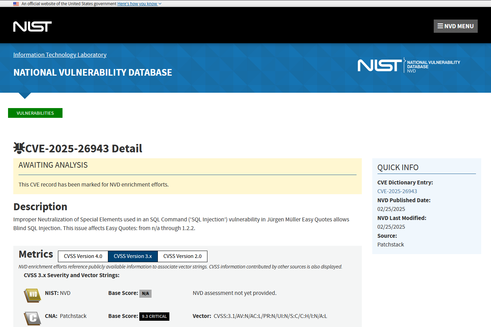
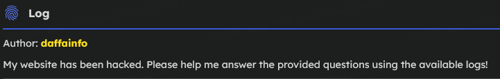
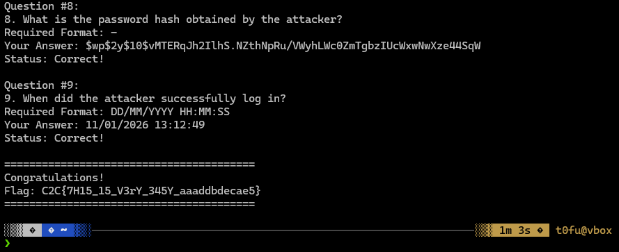

# C2C CTF Task : Log

### Introduction 



> This will strictly from the log `access.log` and `error.log` to answer the questions below

### Connect the Server

```bash
nc challenges.1pc.tf XXXXXXX
```
### **Q & A**

### Q1

What is the Victim's IP address?
Required Format: 127.0.0.1



> Your Answer: **182.8.97.244**

### Q2

What is the Attacker's IP address?
Required Format: 127.0.0.1



> Your Answer: **219.75.27.16**

### Q3

How many login attempts were made by the attacker?
Required Format: 1337



NOTE: you can find it by this `"POST /wp-login.php HTTP/1.1" 200 2583` filter

> Your Answer: **6**

### Q4

Which plugin was affected (Full Name)?
Required Format: -



> Your Answer: **Easy Quotes**

### Q5

What is the CVE ID?
Required Format: CVE-XXXX-XXXX

I checked the log for the pattern of commonly used attack and found it 

```py
[Sun Jan 11 12:52:05.496405 2026] [php:notice] [pid 60:tid 60] [client 172.18.0.1:39926] WordPress database error Subquery returns more than 1 row for query SELECT * FROM `wp_easy-quotes-families` WHERE `family`='1' AND 1979=(SELECT (CASE WHEN (1979=6978) THEN 1979 ELSE (SELECT 6978 UNION SELECT 2384) END))-- -'; made by require('wp-blog-header.php'), wp, WP->main, WP->parse_request, do_action_ref_array('parse_request'), WP_Hook->do_action, WP_Hook->apply_filters, rest_api_loaded, WP_REST_Server->serve_request, WP_REST_Server->dispatch, WP_REST_Server->respond_to_request, Quotes_Rest_Route->rest_route_callback_fonts, Quotes_Data::get_family, Quotes_Data::get_family_data, referer: http://165.22.125.147/wp-json/layart/v1/fonts?family=1
```

hmmm... a blind attack, lemme just check it 

wallah 



> Your Answer: **CVE-2025-26943**

### Q6

Which tool and version were used to exploit the CVE?
Required Format: tool_name/13.3.7

```bash
219.75.27.16 - - [11/Jan/2026:13:12:49 +0000] "POST /wp-login.php HTTP/1.1" 302 1275 "http://165.22.125.147/wp-login.php?redirect_to=http%3A%2F%2F165.22.125.147%2Fwp-admin%2F&reauth=1" "Mozilla/5.0 (Macintosh; Intel Mac OS X 10_14_6) AppleWebKit/537.36 (KHTML, like Gecko) Chrome/120.0.6099.56 Safari/537.36"
```


> Your Answer: **sqlmap/1.10.1.21**

### Q7

What is the email address obtained by the attacker?
Required Format: r00t@localhost.xyz

Ahh yess the author....



> Your Answer: **admin@daffainfo.com**

### Q8

What is the password hash obtained by the attacker?
Required Format: -
> Your Answer: **$wp$2y$10$vMTERqJh2IlhS.NZthNpRu/VWyhLWc0ZmTgbzIUcWxwNwXze44SqW**

### Q9

When did the attacker successfully log in?
Required Format: DD/MM/YYYY HH:MM:SS

```py
219.75.27.16 - - [11/Jan/2026:13:12:49 +0000] "POST /wp-login.php HTTP/1.1" 302 1275 "http://165.22.125.147/wp-login.php?redirect_to=http%3A%2F%2F165.22.125.147%2Fwp-admin%2F&reauth=1" "Mozilla/5.0 (Macintosh; Intel Mac OS X 10_14_6) AppleWebKit/537.36 (KHTML, like Gecko) Chrome/120.0.6099.56 Safari/537.36"
```

> Your Answer: **11/01/2026 13:12:49**

### Flag

```
========================================
Congratulations!
Flag: C2C{7H15_15_V3rY_345Y_aaaddbdecae5}
========================================
```



