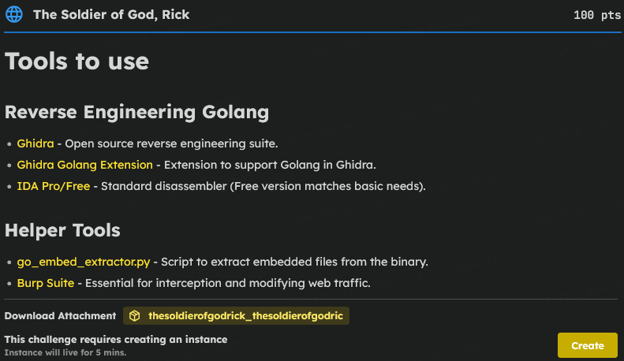
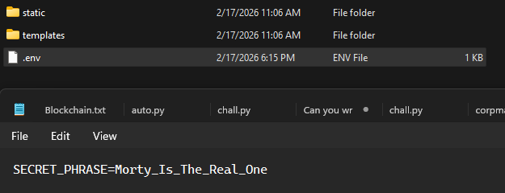
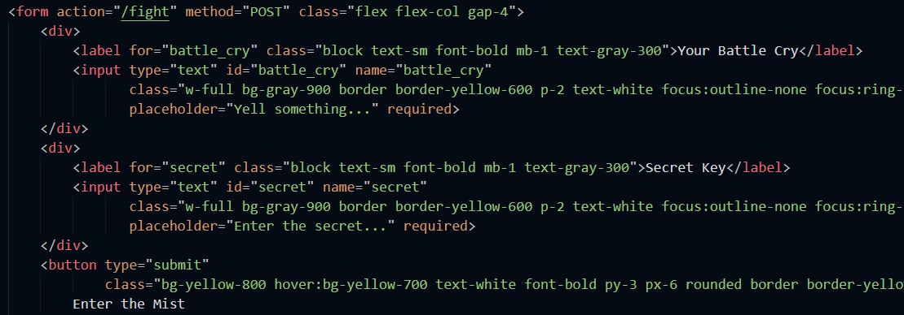
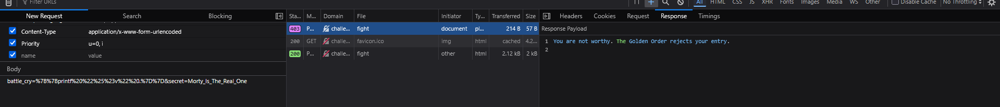
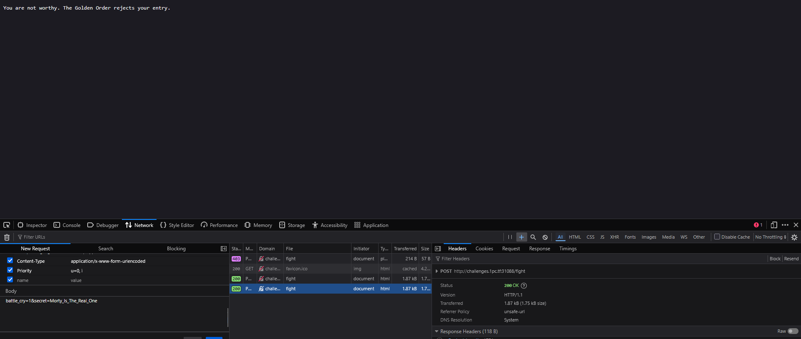
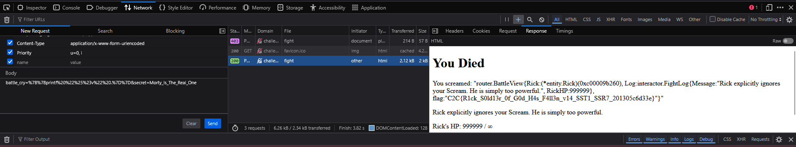

# C2C CTF Task : The Soldier of God, Rick

### Introduction

> My first thought was to figure out what was inside the provided Golang binary. Since the challenge description hinted at `go_embed_extractor.py`, I ran it against the executable.
 This was a lucky break! The script extracted a few frontend files (`index.html`, `style.css`) and, most importantly, a `.env` file.
 Inside the `.env` file, I found a hardcoded secret: `SECRET_PHRASE=Morty_Is_The_Real_One`. I knew I’d need this later to bypass some kind of check.

 

### Investigating the Web Traffic

> I spawned the 5-minute live instance and opened it in my browser. I saw a game interface but knew the real attack vector was likely in the HTTP requests.
 Looking at the extracted `index.html`, I noticed a commented-out section for a ``. I triggered the form on the site and intercepted the traffic using Burp Suite.
 The POST request to the `/fight` endpoint sent two parameters in the body: `battle_cry=1&secret=1`.
 The server responded with a `403 Forbidden: You are not worthy.`

### Bypassing the Authorization

> I suspected the `secret=1` parameter was the reason I was getting rejected.
 I went to the Burp Suite Repeater tab and swapped `secret=1` with the phrase I found earlier: `secret=Morty_Is_The_Real_One`.
 It worked! The server returned a `200 OK`. However, I "died" in the game and didn't immediately get the flag.

### Discovering the Real Vulnerability (SSTI)

> Looking closely at the `200 OK` HTML response, I noticed my exact input was reflected on the page: `You screamed: "1"`.
 Since I knew the backend was written in Golang, I suspected the developer might be passing my input directly into the HTML template unsafely.
 To test for Server-Side Template Injection (SSTI), I changed my `battle_cry` payload to the standard Go template syntax to dump the current object: `{{ . }}` (URL-encoded as `%7B%7B.%7D%7D`).
 The server responded by dumping a Go struct: `BattleView{Rick: Rick...}`. I had code execution, but the flag wasn't there yet.

### The Final Exploit

> The basic `{{ . }}` payload only shows the default string representation of the object, which often hides background variables.
 To force the server to dump its raw memory structure (including unexported fields), I escalated the SSTI payload using Go's `printf` formatting: `{{printf "%#v" .}}`.
 I sent the final payload: `battle_cry=%7B%7Bprintf%20%22%25%23v%22%20.%7D%7D&secret=Morty_Is_The_Real_One`
 The server dumped the entire raw struct memory to the screen, revealing the hidden flag inside one of the fields. And there you have the flag

 