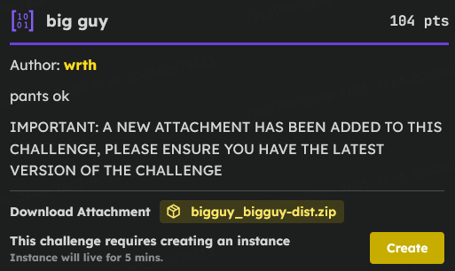
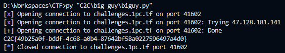

# C2C CTF Task : big guy

### Introduction 



> The challenge uses AES in CTR mode, which acts like a stream cipher. If I can trick the server into encrypting a dummy payload using the exact same counter used for the flags, I can steal the keystream and decrypt them myself

### Obstacle 

```py
def plagiarism_check(a, b):
    if xor(bytes(a), bytes(b)).count(0) > 13:
        return True
    return False
```

> The ``plagiarism_check`` function actively stops me from just resending the original IVs by rejecting anything that shares more than 13 bytes with a previously used IV. This means my payloads must always change by at least 3 bytes to be accepted

### FLAG2 MSB Trick

```py
def handle_request(req):
    try:
        plaintext = req["plaintext"].encode()
        req_pants = req
        req_big = req_pants.copy()

        if isinstance(req_big["iv"], str):
            req_big["iv"] = bytearray(req_big["iv"].encode())
        elif isinstance(req_big["iv"], list):
            req_big["iv"] = bytearray(req_big["iv"])

        if h(bytes(req_big["iv"])) in BIG_IVS or any(
            plagiarism_check(h(bytes(req_big["iv"])), iv) for iv in BIG_IVS
        ):
            print("nope")
            return
        BIG_IVS.add(h(bytes(req_big["iv"])))

        if isinstance(req_pants["iv"], str):
            req_pants["iv"] = bytearray(req_pants["iv"].encode())
        if isinstance(req_pants["iv"], list):
            req_pants["iv"] = bytearray(req_pants["iv"])
        for i in range(16):
            req_pants["iv"][i] &= 0x7F

        ct_big = encrypt(KEY, h(bytes(req_big["iv"])), plaintext)
        print(f"{ct_big = }")

        if h(bytes(req_pants["iv"])) in PANTS_IVS or any(
            plagiarism_check(h(bytes(req_pants["iv"])), iv) for iv in PANTS_IVS
        ):
            print("nope")
            return
        PANTS_IVS.add(h(bytes(req_pants["iv"])))

        ct_pants = encrypt(KEY, h(bytes(req_pants["iv"])), plaintext)
        print(f"{ct_pants = }")

    except:
        print("nope")
        return
```

> I noticed a flaw in ``handle_request``: the server checks the raw IV against `BIG_IVS` before stripping the Most Significant Bits (MSBs) to use for `pants`. By spamming the `reset` command until the server randomly generated a `big_guy` array with at least three values ≥128, I could send `pants` as my raw IV. It differed from `big_guy` by 3 bytes (passing the check) but ultimately gave me the exact keystream for `h(pants)`!

### FLAG1 Counter Sliding

> For the first half of the flag, I couldn't use the MSB trick, so I mathematically forced the AES counter to start slightly before the target `h(big_guy)` counter. By modifying the 13th byte of my IV to be exactly one less than `big_guy`'s 13th byte, I guaranteed the counter would eventually "slide" into the flag's keystream

### Brute-Force Finish

> Because the `MAGIC_WORD` was XORed into the IVs, I didn't know the exact value needed to make my 13th byte "one less". However, since `MAGIC_WORD` only uses printable characters, I just guessed all ~100 possibilities, requested a massive plaintext of "A"s, and scanned the resulting keystreams until the decrypted text revealed `1pc{`

### Script

> After long pause and reconsideration, I came to conclusion of this bruteforce and developed a script :

**NOTE** : Make sure to install `pwntools`

```py
import json
import ast
import string
from pwn import *

def solve():
    r = remote("challenges.1pc.tf", 32077)

    while True:
        r.recvuntil(b"spongebob ")
        line = r.recvline().decode()
        big = json.loads(line[:line.find(']')+1])

        flag1_ct = bytes.fromhex(r.recvline().decode().split("'")[1])
        flag2_ct = bytes.fromhex(r.recvline().decode().split("'")[1])

        if sum(1 for x in big if x >= 128) >= 3 and big[13] >= 128:
            break
        r.sendline(json.dumps({"options": "reset"}).encode())

    pants = [x & 0x7F for x in big]

    r.sendline(json.dumps({
        "options": "encrypt",
        "iv": pants,
        "plaintext": "A" * len(flag2_ct)
    }).encode())

    ct_big = ast.literal_eval(r.recvline().decode().split(" = ")[1])
    ks2 = xor(ct_big, b"A" * len(flag2_ct))
    flag2 = xor(flag2_ct, ks2)
    r.recvline()

    candidates = set()
    for c in string.printable:
        B = big[13] ^ ord(c)
        if B != 0:
            candidates.add((B - 1) ^ ord(c))

    flag1 = b""

    for k, val in enumerate(list(candidates)):
        iv = list(big)
        iv[13] = val
        iv[14] = big[14] ^ (255 - k)
        iv[15] = big[15] ^ (255 - k)

        pt = "A" * (131072 * 16 + len(flag1_ct))

        r.sendline(json.dumps({
            "options": "encrypt",
            "iv": iv,
            "plaintext": pt
        }).encode())

        line = r.recvline().decode().strip()
        if "nope" in line:
            continue

        ct_big = ast.literal_eval(line.split(" = ")[1])
        r.recvline()

        ks1 = xor(ct_big, b"A" * len(pt))

        for i in range(0, len(ks1) - len(flag1_ct) + 1, 16):
            guess = xor(flag1_ct, ks1[i:i+len(flag1_ct)])
            if guess.startswith(b"1pc{") or all(32 <= x <= 126 for x in guess):
                flag1 = guess
                break
        if flag1:
            break

    print((flag1 + flag2).decode())
    r.close()

if __name__ == "__main__":
    solve()
```

And then Wallah, We got the Flag

