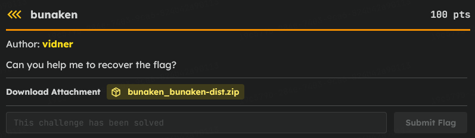
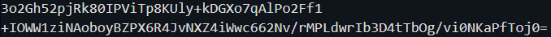
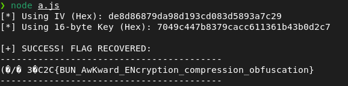

# C2C CTF Task : bunaken

### Introduction



> I started by looking at the two files provided: the Linux executable (`bunaken`) and the encrypted text file (`flag.txt.bunakencrypted`). I immediately suspected that the executable was a custom ransomware or encryption tool used to lock the flag, meaning I needed to figure out its internal logic to reverse the process.

### Finding Hardcoded Password

> Before diving into a complicated decompiler like Ghidra, my go-to newbie move is to run basic static analysis tools like `strings` on the binary. While scrolling through the output, a completely out-of-place word caught my eye: `"sulawesi"`. It looked extremely suspicious and I had a strong hunch this was the hardcoded password the program used to encrypt files and also found the clue 1



### Extracting the IV

> Next, I had to figure out how the Initialization Vector (IV) was being handled in the encrypted file. In a lot of beginner friendly CTFs, encryption tools are lazy and just prepend the randomly generated 14-to-16 byte IV directly to the start of the file. I assumed the first 16 bytes of the base64-decoded file were the IV, and the rest was the actual ciphertext.

### Key Derivation Snag

> I guessed the cipher was standard AES-128-CBC, but there was a problem: AES-128 requires a 16-byte key, and `"sulawesi"` is only 8 bytes. I figured the binary must be hashing the password under the hood to stretch it. Since a standard SHA-256 hash outputs 32 bytes, I theorized the program simply took the SHA-256 hash of `"sulawesi"` and truncated it, keeping only the first 16 bytes to perfectly fit the AES-128 requirement

### Script

> Now I had all the puzzle pieces. I knew the target cipher (`aes-128-cbc`), I had the isolated IV from the file header, and I knew how to derive the correct 16-byte key (`SHA256("sulawesi")[0:16]`)

**NOTE** : Run with ```node script.js``` inside the dir with files

```js
const crypto = require("crypto");

const key = "sulawesi";
const data = Buffer.from("3o2Gh52pjRk80IPViTp8KUly+kDGXo7qAlPo2Ff1+IOWW1ziNAoboyBZPX6R4JvNXZ4iWwc662Nv/rMPLdwrIb3D4tTbOg/vi0NKaPfToj0=", "base64");

const iv = data.subarray(0, 16);
const enc = data.subarray(16);

const hash = crypto.createHash("sha256").update(key).digest().subarray(0, 16);

const decipher = crypto.createDecipheriv("aes-128-cbc", hash, iv);
let out = decipher.update(enc);
out = Buffer.concat([out, decipher.final()]);

console.log(out.toString());
```

And then we will get the flag :

