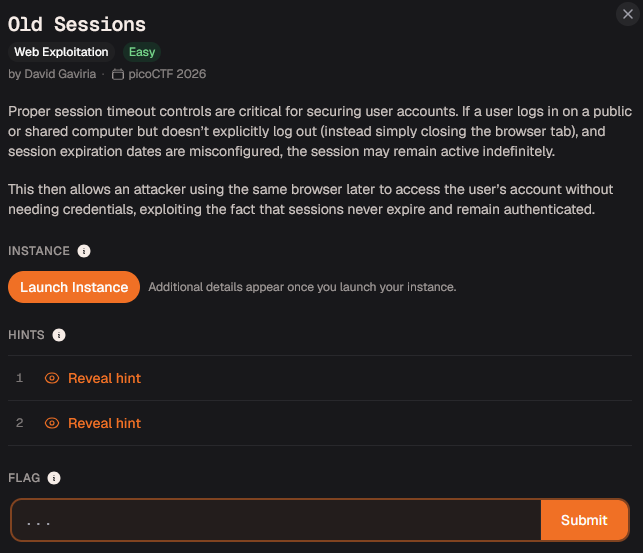
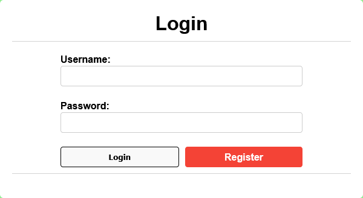
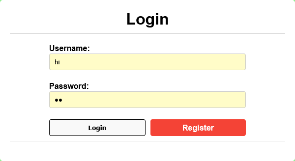
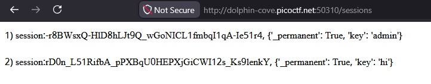
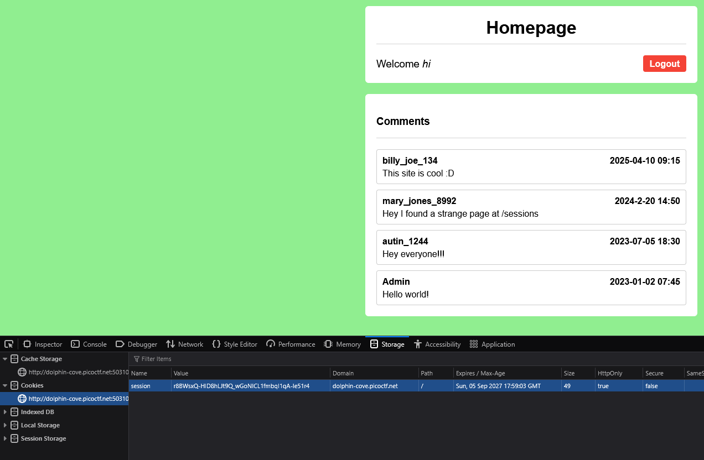

# 0ld Sessions - Writeup by T0fu

> **Cylab Security Academy — Web Exploitation CTF**


| Content | Section                                             |
|   :---  | ----------------------------------------------------|
|   1     | **[Challenge Information](#challenge-information)** |
|   2     | **[Walkthrough](#walkthrough)**                     |
|   3     | **[Flag](#flag)**                                   |
|   4     | **[Guide Video](#guide)**                           |


## **Challenge Information**

| Field          | Details                
| -------------- | ---
| **Author**     | <span style="color:cyan">**T0fu**</span>                  
| **Platform**   | <span style="color:grey">**Cylab Security Academy**</span>
| **Difficulty** | <span style="color:lime">**Easy**</span>                    
| **Category**   | <span style="color:gold">**Web Exploitation**</span>      
| **Objective**  | <span style="color:pink">**Obtain Flag**</span>      

### **Description**

This will be the brief description.



Welp ... We Ball


## **Walkthrough**

This section documents the step by step process used to identify and exploit the vulnerability.

### 1. Launch the Challenge

Start the challenge instance and open the provided web application.

The application displays a login page.



### 2. Register and Log In

Create a new account using any username and password, then log in with the newly created credentials.

In this example, the username `hi` was used.



### 3. Identify the Sessions Endpoint

After logging in, inspect the application for possible clues.

A comment containing the `/sessions` endpoint can be found in the page content.


Navigate to the endpoint by appending `/sessions` to the application URL:

```text
https://<URL>/sessions
```



The endpoint reveals active session information:

```text
1. session:-r8BWsxQ-HlD8hLJt9Q_wGoNICL1fmbqI1qA-Ie51r4
   {'_permanent': True, 'key': 'admin'}

2. session:rD0n_L51RifbA_pPXBqU0HEPXjGiCWI12s_Ks9lenkY
   {'_permanent': True, 'key': 'hi'}
```

### 4. Analyze the Vulnerability

The exposed data contains:

* An active administrator session
* The session belonging to the newly created user
* A predictable relationship between each session and its assigned username

Because the application exposes valid session cookies and does not properly invalidate them, the administrator session can be reused.

This is a form of **session hijacking caused by session information disclosure**.

### 5. Exploit the Session

Replace the current user's session cookie with the exposed administrator session cookie.

#### Browser Procedure

1. Return to the main application page.
2. Open **Developer Tools**.
3. Select **Storage** or **Application**.
4. Open the **Cookies** section.
5. Locate the session cookie.
6. Replace its value with the administrator session value.
7. Reload the page.

```text
-r8BWsxQ-HlD8hLJt9Q_wGoNICL1fmbqI1qA-Ie51r4
```



After refreshing the page, the application recognizes the session as belonging to the administrator.

### **Flag**

<details>
<summary><strong>Reveal Flag</strong></summary>

```text
picoCTF{s3t_s3ss10n_3xp1rat10n5_10f20509}
```

</details>

## **Well ... It's not too bad right**


## **Guide**
<video controls src="20260801-1845-52.1476184.mp4" title="Guide"></video>